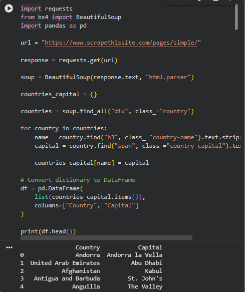

# 🌐 Web Scraping Review Lab

## 📖 Overview

This project demonstrates the fundamentals of Web Scraping using Python and BeautifulSoup. The lab covers HTML parsing, data extraction, DOM navigation, and building a simple real-world scraper.

---

## 🎯 Objectives

- Understand HTML structure
- Parse webpages using BeautifulSoup
- Extract information from websites
- Store scraped data in Python data structures
- Convert scraped data into Pandas DataFrames
- Export data to CSV files

---

## 🛠️ Technologies Used

- Python
- Requests
- BeautifulSoup (bs4)
- Pandas
- Jupyter Notebook

---

## 📚 Concepts Covered

### HTML Parsing
- HTML Tags
- Attributes
- Nested Elements
- DOM Structure

### BeautifulSoup
- Creating Soup Objects
- Finding Tags
- Extracting Text
- Navigating Parents and Children

### Data Extraction
- Web Page Scraping
- Data Cleaning
- Data Storage
- CSV Export

---

## 🚀 Mini Project: Country & Capital Scraper

### Project Description

A simple web scraping project that extracts countries and their capitals from a webpage and stores the information in a structured format using Python dictionaries and Pandas DataFrames.

### Source Website

```python
https://www.scrapethissite.com/pages/simple/
```

### Features

- Scrapes country names
- Extracts capital cities
- Stores data in a Python dictionary
- Converts data into a Pandas DataFrame
- Saves data as CSV

### Sample Code

```python
import requests
from bs4 import BeautifulSoup
import pandas as pd

url = "https://www.scrapethissite.com/pages/simple/"

response = requests.get(url)

soup = BeautifulSoup(response.text, "html.parser")

countries_capital = {}

countries = soup.find_all("div", class_="country")

for country in countries:
    name = country.find("h3", class_="country-name").text.strip()
    capital = country.find("span", class_="country-capital").text.strip()

    countries_capital[name] = capital

df = pd.DataFrame(
    list(countries_capital.items()),
    columns=["Country", "Capital"]
)

print(df.head())
```

### Sample Output

| Country | Capital |
|----------|----------|
| Andorra | Andorra la Vella |
| Afghanistan | Kabul |
| India | New Delhi |
| France | Paris |
| Germany | Berlin |



### Export Data

```python
df.to_csv("countries_capitals.csv", index=False)
```

---

## 📂 Project Structure

```text
web-scraping-review-lab/
│
├── Web-Scraping-Review-Lab.ipynb
├── countries_capitals.csv
├── README.md
```

---

## 💡 Skills Gained

- Web Scraping
- HTML Parsing
- Data Extraction
- BeautifulSoup
- Requests Library
- Data Cleaning
- Pandas DataFrames
- CSV Handling

---

## 🎓 Learning Outcome

By completing this project, I gained practical experience in:

- Collecting data from websites
- Parsing HTML content
- Extracting structured information
- Working with Python dictionaries
- Converting data into DataFrames
- Preparing datasets for analysis

---

## 👨‍💻 Author

**Santhose Arockiaraj J**

B.Tech Artificial Intelligence & Data Science  
Saveetha Engineering College

GitHub: https://github.com/Santhose-DOC

LinkedIn: https://www.linkedin.com/in/santhose-arockiaraj-j

---

⭐ This project is part of my journey in Data Science, AI, and Python development.